# TreasureHunt Sample

Create an algorith to automatically populate the database, search for treasure by coordinate, distance and prize value. the distance calculation was taken from [http://www.movable-type.co.uk/scripts/latlong.html](http://www.movable-type.co.uk/scripts/latlong.html), it uses the ‘**haversine**’ formula to calculate the great-circle distance between two points. cross checked with other online distance calculator for coordinates and the result is correct.

This system uses [nodeJS](https://nodejs.org/en/) as the runtime environment, [expressJS](https://expressjs.com/) as the framework, [mongoDB Community Server](https://www.mongodb.com/) as the database and [mongoose](https://mongoosejs.com/) as the ODM library for mongoDB.

## Download and execute [mongoDB](https://www.mongodb.com/try/download/community)

### Or check [MongoDB installation Tutorials](https://www.mongodb.com/docs/manual/installation/#mongodb-installation-tutorials)

### For Windows

1. Download community server database download
   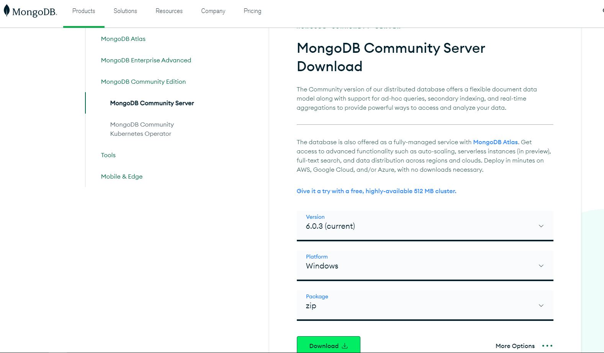
2. After download completes extract the zip file(mongodb-windows-x86_64-6.0.3) to desired location
   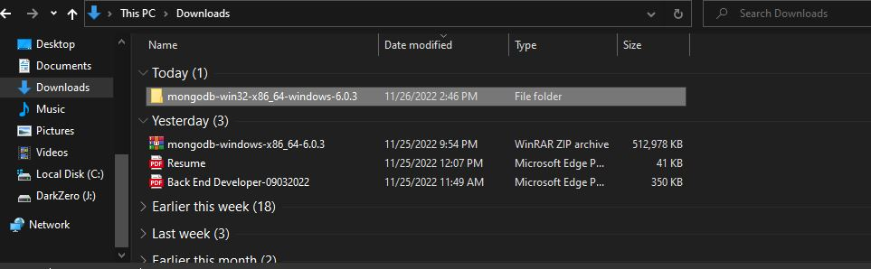
3. Open command prompt and goto extracted file and goto bin folder(`cd location/of/extracted/file/mongodb-win32-x86_64-windows-6.0.3/bin`)
   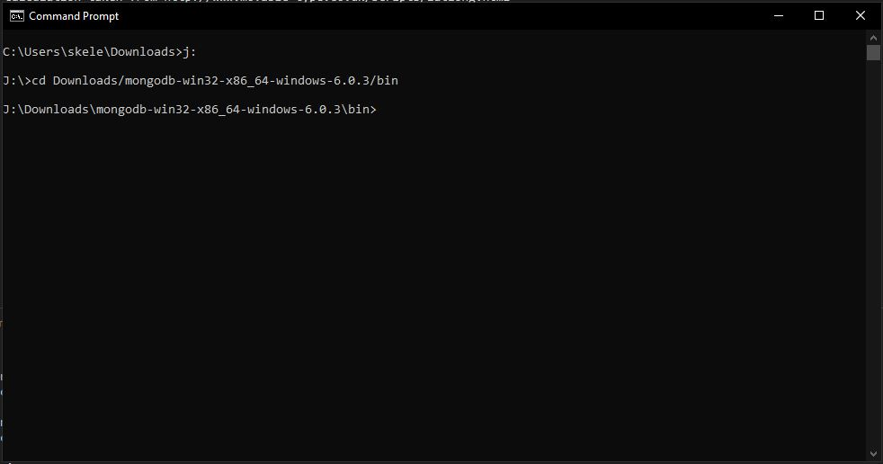
4. Create directory "data"
   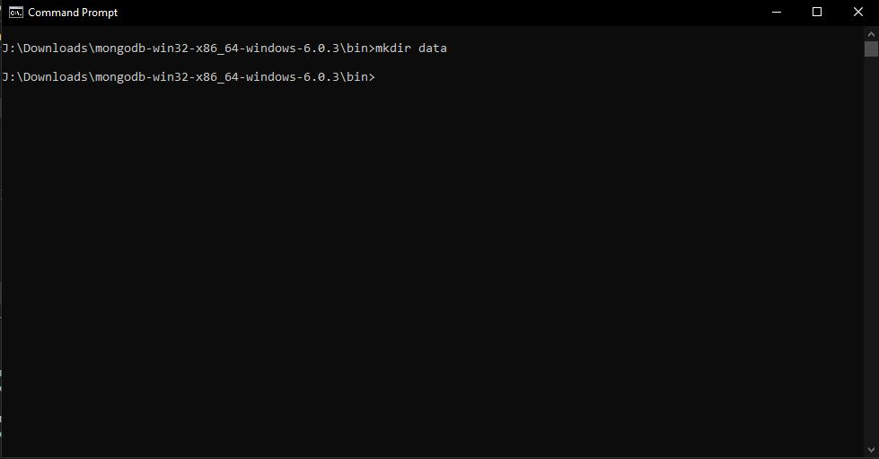
5. Execute command `monggod.exe --dbpath ./data` to run the database server
   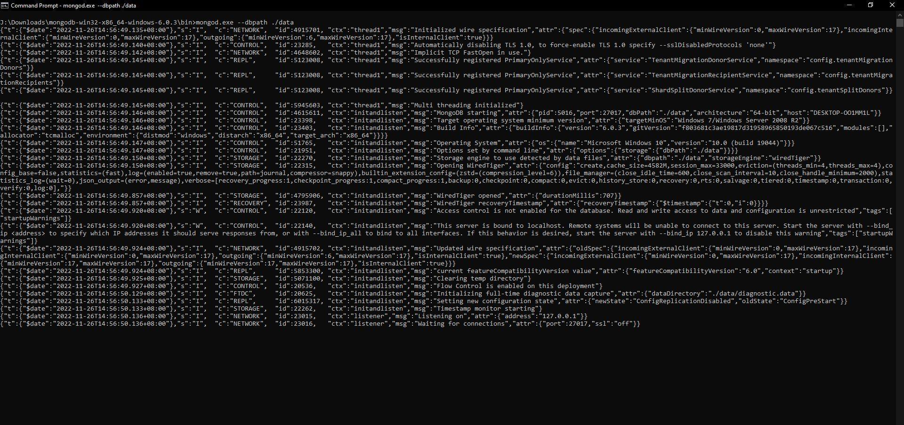
6. To check if the database is working goto to [localhost:27017](http://localhost:27017/), and it will show _It looks like you are trying to access MongoDB over HTTP on the native driver port._
   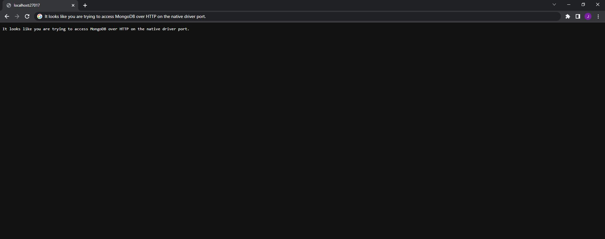

## Execute The System

1. [Download And Execute MongoDB server](#download-and-execute-mongodb)
2. Open command prompt and goto to system location
3. Execute Command `npm install`
4. To populate data execute command `npm run populate`, to automatically populate database with the given sample
   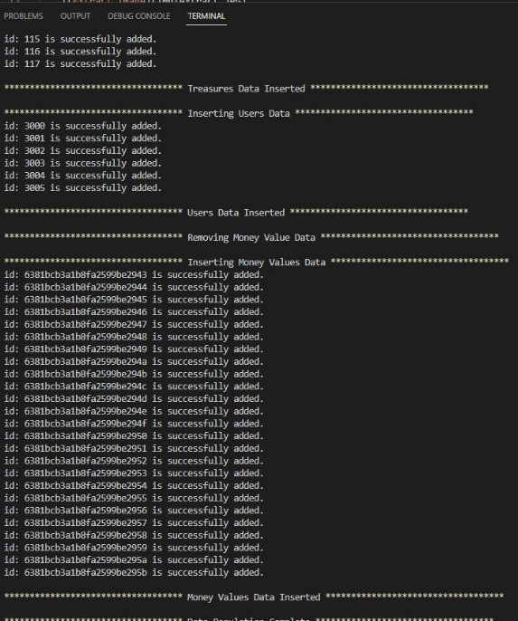
5. To start the system execute command `npm start`(_the system url will be [localhost:3000](http://localhost:3000)_)

## Routes Available in the System Example

### Request(Example #1)

`GET localhost:3000/nearMe?latitude=14.552036595352455&longitude=121.01696118771324&distance=1`

    Query Parameters:
    {
        latitude:14.552036595352455,
        longitude:121.01696118771324,
        distance:1 //accepts only 1 or 10 as the value
    }

### Response

    [
        {
            "_id": "6381bcb3a1b8fa2599be2926",
            "id": 100,
            "latitude": 14.54376481,
            "longitude": 121.0199117,
            "name": "T1"
        },
        {
            "_id": "6381bcb3a1b8fa2599be2928",
            "id": 102,
            "latitude": 14.54464357,
            "longitude": 121.0203656,
            "name": "T3"
        }
    ]

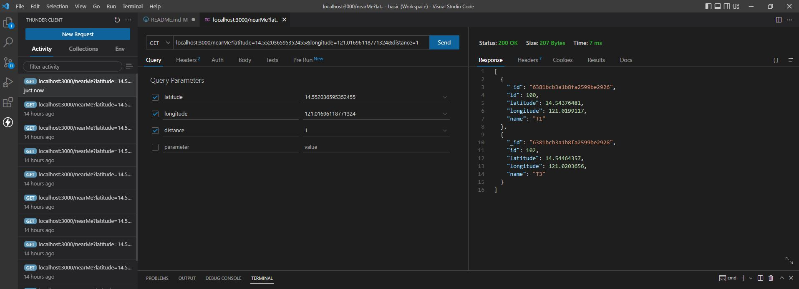

### Request(Example #2)

`GET localhost:3000/nearMe?latitude=14.552036595352455&longitude=121.01696118771324&distance=1&prize_value=10-30`

    Query Parameters:
    {
        latitude:14.552036595352455,
        longitude:121.01696118771324,
        distance:1, //accepts only 1 or 10 as the value
        prize_value:10-30 //optional parameter. accepts only range from 10-30 and strictly no decimal value
    }

### Response

    [
        {
            "_id": "6381bcb3a1b8fa2599be2926",
            "id": 100,
            "latitude": 14.54376481,
            "longitude": 121.0199117,
            "name": "T1",
            "value": {
            "_id": "6381bcb3a1b8fa2599be2943",
            "treasure_id": 100,
            "amount": 15,
            "__v": 0
            }
        },
        {
            "_id": "6381bcb3a1b8fa2599be2928",
            "id": 102,
            "latitude": 14.54464357,
            "longitude": 121.0203656,
            "name": "T3",
            "value": {
            "_id": "6381bcb3a1b8fa2599be2945",
            "treasure_id": 102,
            "amount": 15,
            "__v": 0
            }
        }
    ]

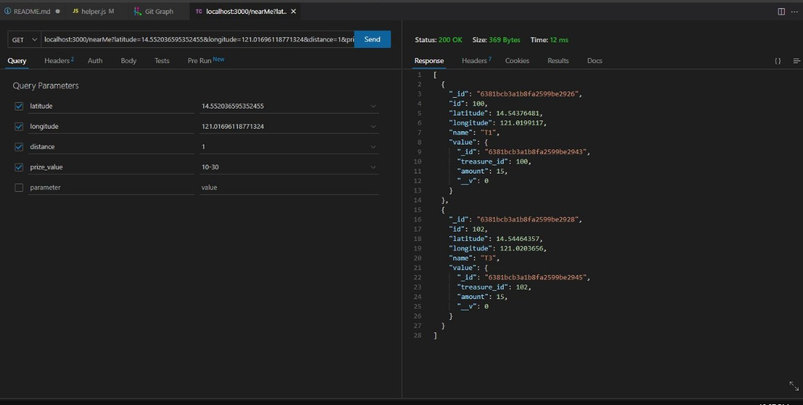

## Bonus Test

    The Concept is the user will login to the game, then the user will trigger the **Treasure Hunt** function. the **Treasure Hunt** function would search for treasure near the users input on a coordinates, the user can add distance and prize value, then the **Treasure Hunt** will find all near the coordinates and will randomize one treasure to be given to the user. the **Treasure Hunt** will cooldown for 5 Minutes to allow another **Treasure Hunt**. The concept will test the limit of your luck, there will be an instance that no treasure will be found, then you need to wait again for 5 Minutes to search again.

### Steps

1. Login user to get `Key`.

   **Request**

   `POST: localhost:3000/login`

   ```
   Parameters: {
       "email": "u4@kitra.abc",
       "password": "456456"
   }
   ```

   **Response**

   ```
   {
       "key": "0e955ef2412042a7c036473a4084ee6c:8816d47c63a16018750dd55c2ad91a6fc094fba2b35723340c32995344301c63fa87142307340a86f8822de59a63a0e85cf1748b7d6ad9a8631d756df356a2d882ee8ec64cf2c91b59af8c620ca0740300f31b7c68e4eda74c5bc72bffae6285"
   }
   ```

   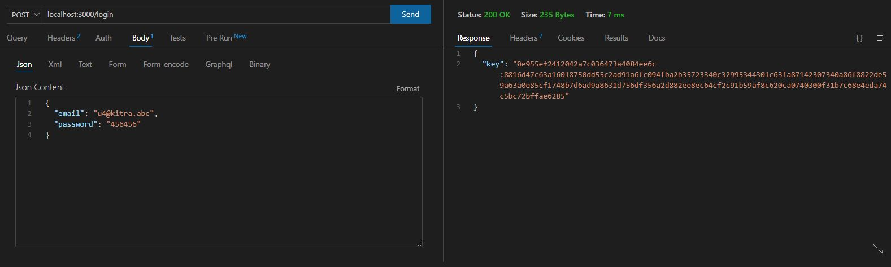

2. Copy `Key`, Then you can start treasure hunt by adding the key as `user-key` on the request header

   **Request**

   `Headers`

   ```
   {
       "Accept": "*/*",
       "User-Agent": "Thunder Client (https://www.thunderclient.com)",
       "user-key": "0e955ef2412042a7c036473a4084ee6c:8816d47c63a16018750dd55c2ad91a6fc094fba2b35723340c32995344301c63fa87142307340a86f8822de59a63a0e85cf1748b7d6ad9a8631d756df356a2d882ee8ec64cf2c91b59af8c620ca0740300f31b7c68e4eda74c5bc72bffae6285",
       "Content-Type": "application/json"
   }
   ```

   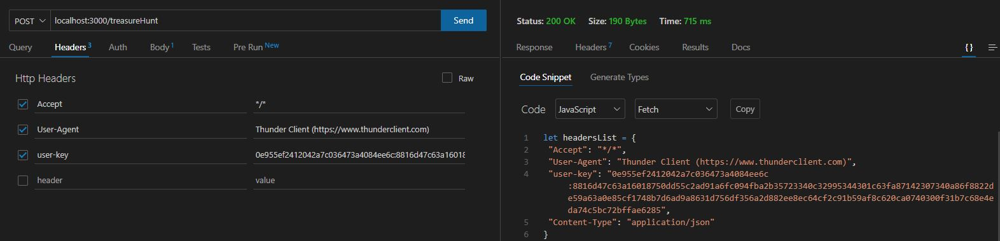

   `POST: localhost:3000/treasureHunt`

   ```
   Parameters: {
       "latitude":14.552036595352455,
       "longitude":121.01696118771324,
       "distance": 1, // optional but retains the original condition. if not set default value is 1
       "prize_value": 10-30 // still optional. if not set default value is 10-30
   }
   ```

   **Response**

   ```
   {
       "message": "Congratulations User U4, you found treasure T3 with the amount of $15. Treasure hunting will be available after 5 Minutes.",
       "data": {
           "email": "u4@kitra.abc",
           "name": "U4",
           "age": 18,
           "id": 3003,
           "foundTreasure": {
           "_id": "6382f139c034f70a1d5d0854",
           "id": 102,
           "longitude": 121.0203656,
           "latitude": 14.54464357,
           "name": "T3",
           "value": {
               "_id": "6382f13ac034f70a1d5d0872",
               "treasure_id": 102,
               "amount": 15,
               "found": 0,
               "__v": 0
           }
           }
       }
   }
   ```

   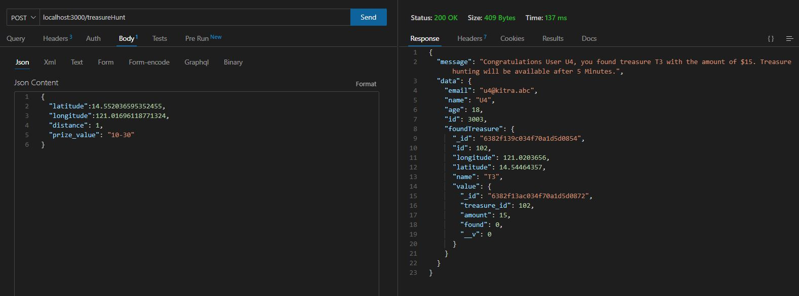

   **Cooldown Sample**

   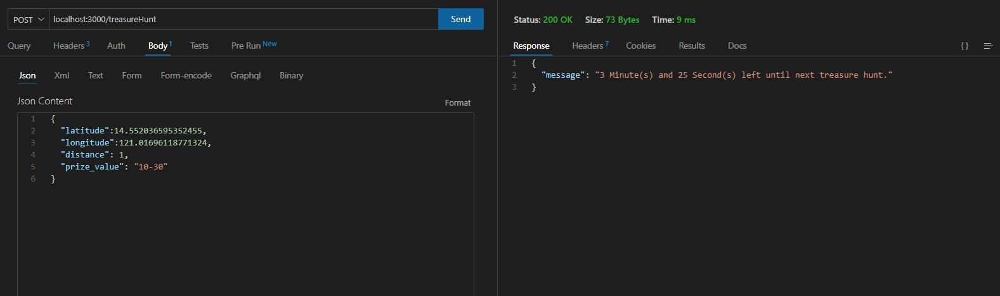

3. To get current users data, still need to add `key` to the request headers as `user-key`

   **Request**

   `GET: localhost:3000/user`

   **Response**

   ```
   [
       {
           "_id": "6382f13ac034f70a1d5d086b",
           "id": 3003,
           "name": "U4",
           "age": 18,
           "email": "u4@kitra.abc",
           "treasures": [
           {
               "_id": "6382f139c034f70a1d5d0854",
               "id": 102,
               "longitude": 121.0203656,
               "latitude": 14.54464357,
               "name": "T3",
               "value": {
               "_id": "6382f13ac034f70a1d5d0872",
               "treasure_id": 102,
               "amount": 15,
               "found": 0,
               "__v": 0
               }
           }
           ],
           "__v": 1,
           "last_treasure": "2022-11-27T05:10:36.192Z"
       }
   ]
   ```

   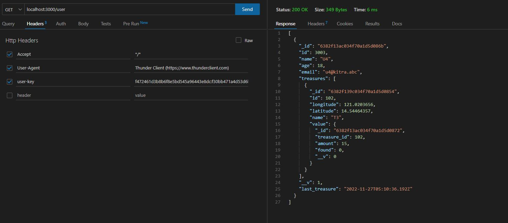
